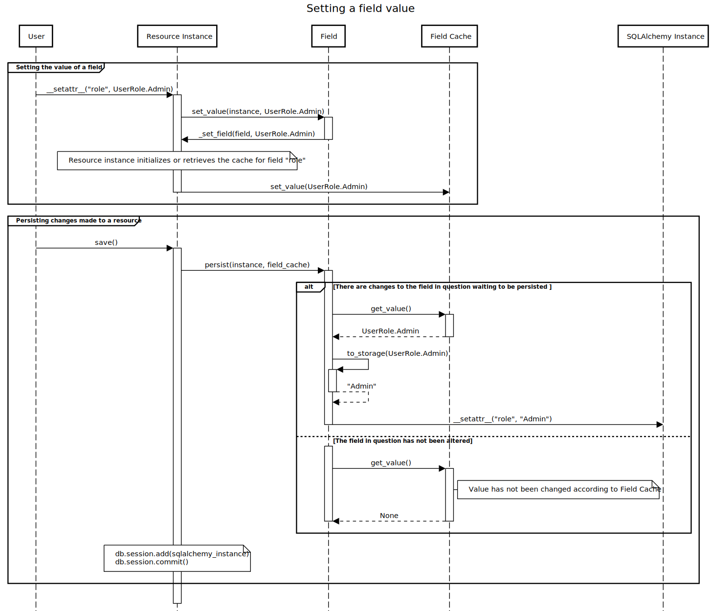
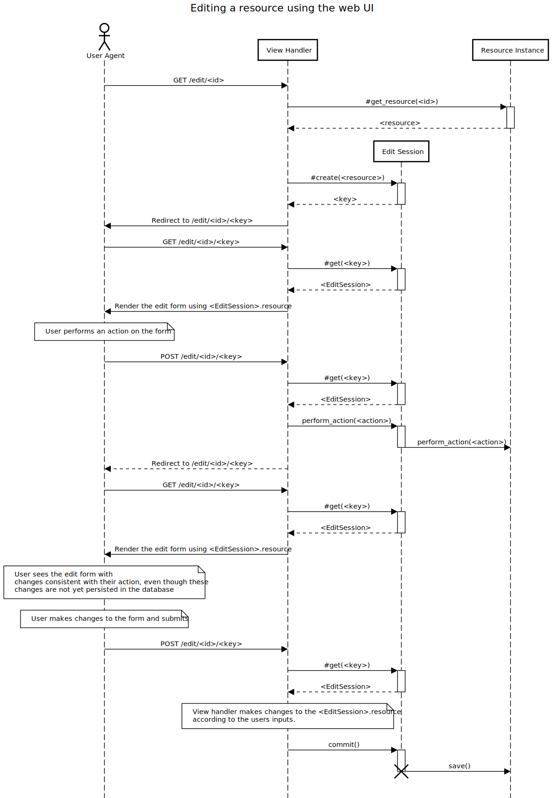

# Architecture Documentation

The architecture of this project is built around the concept of `Resource`s of which there are multiple types. All of these types share functionality and data: all of them can be created, viewed, edited and deleted by the user, all of them have an associated time of creation and creator, as well as a set of assigned users, among other common associated data.

In addition to these common traits, each of the resource types has a set of associated `Field`s. These fields can contain different types of information, and in the most simplest cases map directly to an underlying database column. Fields contain also additional information about how the field should be presented to the user and it's access control configuration.

## Resources

Lets consider the following example:

```python
class User(BaseResource):
	__acl__ = AccessControlList('c=A,w=As,r=o,d=A')
	
	username = TextField(unique=True)
	password = PasswordField()
	bio = TextField()
	avatar = FileField(widget='image')
	
	def title(self):
		return self.username
```

This class defines a new resource type called `User`, which has the fields `username`, `password`, `bio` and `avatar`. The class looks for these values from a database table called `users` from columns with same names as the attributes of the class.

The `__acl__` attribute defines the Access Control List of the resource type, in other words, who has the permission to perform different actions on an instance of this resource type. The ACL is defined using a shorthand syntax, which consists of a list of (access type, access group list)-pairs. The defined access types are **c**reation, **w**riting, **r**eading and **d**eletion. The access groups define who gets to perform these actions, and are defined below:

1. **A**dmin. All users with the Administrator role belong to the group for all resources.
2. **a**ssigned. This group consists of the users who are assigned to this resource (or to whom this resource is assigned -- however way you want to thing about it).
3. **O**wner. This group refers to the singular owner of the resource, which, at the moment, is the creator of the resource.
4. **o**ther. This group contains all users on the system.
5. **s**elf. This is a special group, which really only makes sense alongside the `User` resource type. Only users whose `User` resource is equal to the resource in question belong to this group.

In addition to resource-level ACLs, it is possible to define field level ACLs by providing the `acl` named parameter on the field constructors. This results in the field being absent for users who do not have the required permissions.

The `title` method can be used to provide (possibly dynamic) human readable title for the resource. If not explicitly defined, the default implementation produces titles of the form `User #12`.

### Lifecycle of a Resource Type

Upon definition, a SQLAlchemy Model is created for each Resource subclass. This model is accessible via the `model` class attribute. The `Field` objects are accessible as normal class attributes, as one would excpect. The fields are also available as a list via the `fields` class attribute.

Just like SQLAlchemy Models, the Resource instances behave quite differently from the class object itself. When accessing the field attributes you do not receive `Field` objects but instead the values of those fields. Setting attributes works the same way. The fields are also accessible dynamically on the instance via the `fields` attribute, this list, however, does not contain `Field` objects but instead contains `BoundField` objects, which can be used to read and write the fields' values and perform other actions.

Changing fields' values using a Resource instance, whether by directly writing to attributes on the object or via the `fields` collection, does not result in the changes immediately persisting in the database. Instead, they are *staged* internally to the resource instance. These staged changes can be persisted to the database by calling the `save()` method on the instance.

## Anatomy of a Special Field Type

There are numerous predefined field types (`TextField`, `PasswordField`, `DateField`, `CurrencyField`, `FileField`, `TableField`, etc.) and each of these types differs from each other in numerous ways, from the way in which the data is presented to the user and in the way in which the data is stored in the database. For this reason the `Field` base class provides numerous useful methods which can be overwritten by subclasses.

The `get_value`, `from_storage` and `retrieve` methods are involved in reading field values from the database while almost symmetrical methods `set_value`, `to_storage` and `persist` methods are involved in the writing of field values. The `create_columns` method can be overwritten in order to define additional fields on the underlying database table.

Fields can define additional "action" methods by marking them using the `@action` decorator. These action methods can be invoked from the resource edit form by setting the `__action` form field to a value like `{field_name}.{method_name}`. This makes it possible for field types to provide other methods of manipulating it's value, aside from a simple overwrite operation. Alongside the field's value, which is read from the form field with same name as the resource field, any form fields beginning with the resource field's name followed by a dot, are passed to the `Field` type when invoking these action method or when simply submitting the form  For example, the `PasswordField` type uses this functionality to validate the password confirmation field before changing the password.

Below are short descriptions of the above-mentioned methods:

1. `get_value` is the entrypoint of the chain of method calls involved in reading a value. There is little reason to overwrite this method, unless you, for whatever reason, want to short-circuit the read operation.
2. `from_storage` converts a value from the in-database representation into an in-memory representation.
3. `retrieve` fetches the column's value from the database. This method can be overwritten if the field's value does not directly map into a single database column.
4. `set_value` is the entrypoint of the chain of method calls involced in writing a value. The possible additional form fields' values are made available for this method as keyword arguments. This method can be overwritten to provide validation.
5. `to_storage` converts a value from the in-memory representation into the in-database representation.
6. `persist` writes the value into the database.
7. `create_columns` returns an list of SQLAlchemy `Column` types which are inserted into the created SQLAlchemy Model class.

## Editing Sessions and Staging

As mentioned in the previous section, field types can define multiple actions in addition to the `set_value` method. The user can invoke these when editing a resource's contents and edit the fields' values in this manner. This means that a single session of editing a resource's contents can involve multiple POST requests and page reloads -- and what's more important -- in between these manipulation operations, the resource may be in such a state that the user might not wish for it to be yet committed into the database for others to see. Thus, we need to keep track of the changes the user has made during a single "editing session", display the resource while taking these changes into account during the subsequent page reloads, and commit these changes to the database when the user submits the edit form.

For now, at least, these editing sessions are maintained only in-memory. This is sufficient because the sessions are ephemeral and we are running only a single instance of the web server, and so we can just hold onto the Resource objects across requests.

When the user navigates to `/edit/<resource_id>` a new editing session is created, alongside an associated randomly generated key, which is used to identify the session. The user is immediately redirected to `/edit/<resource_id>/<editing_session_id>` and a editing form is rendered. Any subsequent POST requests redirect to this same address, and by using the editing session ID, we can maintain state across the whole editing process.

## Some miscellaneous, messy, and hard to understand sequence diagrams




